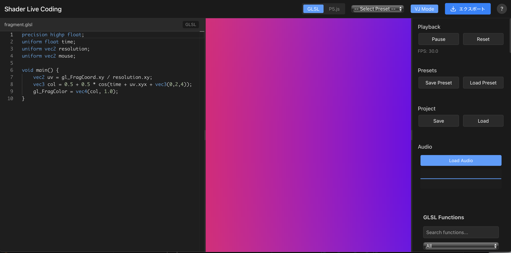

# Shader Live Coding

A real-time shader live coding application for VJ performances, built with Tauri 2.0 and Svelte 5.

リアルタイムシェーダーライブコーディングアプリケーション。VJパフォーマンスや創造的なビジュアル表現のために設計されています。



## Features / 機能

- **Real-time Shader Editing / リアルタイムシェーダー編集**: Live code your GLSL shaders with instant preview / GLSL、WGSL、Slangに対応
- **Audio Reactive / 音楽同期**: Sync visuals with music using real-time FFT analysis / オーディオファイルを読み込んで、音楽に反応するビジュアルを作成
- **Preset Management / プリセット管理**: Save and load your favorite shader presets / 作成したシェーダーを保存・管理
- **VJ Mode / VJモード**: Fullscreen performance mode with keyboard shortcuts / フルスクリーン表示とキーボードショートカット
- **Export Capabilities / エクスポート機能**: Export as images, videos, or standalone HTML / 静止画や動画として作品を保存
- **Monaco Editor**: Professional code editor with syntax highlighting / シンタックスハイライト付きの高機能エディタ
- **Cross-platform / クロスプラットフォーム**: Works on macOS, Windows, and Linux / macOS、Windows、Linuxで動作

## Installation / インストール

### Download Pre-built Binaries / ビルド済みバイナリのダウンロード

Download the latest release from the [Releases page](https://github.com/northprint/shader-live-cording/releases):

最新のリリースは[リリースページ](https://github.com/northprint/shader-live-cording/releases)からダウンロードできます：

- **macOS**: `.dmg` file / `.dmg`ファイル
  - Apple Silicon (M1/M2): `shader-live-coding_0.0.1_aarch64.dmg`
  - Intel: `shader-live-coding_0.0.1_x64.dmg`
- **Windows**: `.msi` installer / `.msi`インストーラー
- **Linux**: `.AppImage` or `.deb` file / `.AppImage`または`.deb`ファイル

### Build from Source / ソースからビルド

Prerequisites / 必要な環境:
- [Node.js](https://nodejs.org/) 18+ (LTS version)
- [pnpm](https://pnpm.io/)
- [Rust](https://www.rust-lang.org/)

```bash
# Clone the repository / リポジトリをクローン
git clone https://github.com/northprint/shader-live-cording.git
cd shader-live-cording

# Install dependencies / 依存関係のインストール
pnpm install

# Run in development mode / 開発サーバーの起動
pnpm tauri:dev

# Build for production / アプリケーションのビルド
pnpm tauri:build
```

## Usage / 使い方

### Basic Workflow / 基本的な操作

1. **Write Shader Code / シェーダーの編集**
   - Use the Monaco editor to write GLSL code / 左側のエディタにGLSLコードを入力
   - Changes are reflected in real-time / 自動的にプレビューが更新されます
   - Syntax errors appear below the editor / シンタックスエラーはエディタ下部に表示されます

2. **Use Presets / プリセットの使用**
   - Select from existing presets in the dropdown / 「Select Preset」ドロップダウンから既存のプリセットを選択
   - Save custom presets with the "Save as Preset" button / カスタムプリセットを保存するには「Save as Preset」ボタンを使用

3. **Audio Sync / 音楽の同期**
   - Load audio files with the "Load Audio" button / 「Load Audio」ボタンからオーディオファイルを選択
   - Control playback with play/pause / 再生/一時停止ボタンで音楽をコントロール
   - Access audio data in shaders using `iAudioData` and `iFrequency` / シェーダー内で`iAudioData`や`iFrequency`などの変数を使用して音楽データにアクセス

### Shader Variables / シェーダー変数

Built-in uniforms available / 以下の組み込み変数が使用できます：

- `iResolution` - Screen resolution (vec3) / 画面の解像度（vec3）
- `iTime` - Elapsed time in seconds (float) / 経過時間（float）
- `iMouse` - Mouse coordinates (vec4) / マウスの座標（vec4）
- `iAudioData` - Audio waveform data (sampler2D) / オーディオの波形データ（sampler2D）
- `iFrequency` - Frequency spectrum data (sampler2D) / 周波数データ（sampler2D）
- `iBass`, `iMid`, `iTreble` - Low, mid, high frequency intensity (float) / 低音、中音、高音の強度（float）

### プリセットシェーダー

#### Basic Template
基本的なシェーダーのテンプレート。カスタムシェーダーの出発点として使用できます。

```glsl
void mainImage(out vec4 fragColor, in vec2 fragCoord) {
    vec2 uv = fragCoord / iResolution.xy;
    vec3 col = vec3(uv, 0.5 + 0.5 * sin(iTime));
    fragColor = vec4(col, 1.0);
}
```

#### Rainbow Wave
時間とともに変化する虹色のウェーブパターン。

#### Audio Visualizer
音楽に反応する円形のビジュアライザー。音楽を読み込んで使用してください。

#### Spectrum Bars
周波数スペクトラムを表示するバー表示。音楽分析に最適です。

#### Particle Flow
音楽に反応するパーティクルシステム。

### Sound Programming（シンセサイザー）

右側パネルの下部にある音楽生成ツール：

- **独立したシンセサイザー**（シェーダーには影響しません）
- **波形選択**: Sine、Square、Sawtooth、Triangleから選択
- **エンベロープ調整**: Attack、Decay、Sustain、Releaseで音の形を制御
- **音量調整**: -30dB〜0dBの範囲で調整
- **キーボード**: C4〜B4の音階をテスト
- **シーケンサー**: BPM調整可能な自動演奏機能

**使用例**:
1. 波形を「Square」に変更してレトロゲーム風の音に
2. Attackを長くしてふわっとした立ち上がりに
3. Releaseを長くして余韻のある音に
4. シーケンサーでリズムパターンを作成

**注意**: このツールで生成した音は、読み込んだオーディオファイルの音楽データのようにシェーダーには反映されません。VJパフォーマンス中のサウンドエフェクトとして使用することを想定しています。

### VJ Mode / VJモード

Performance features / VJパフォーマンス用の機能：

- **F11**: Toggle fullscreen / フルスクリーン切り替え
- **Space**: Play/Pause / 再生/一時停止
- **1-9**: Switch presets / プリセットの切り替え
- **Esc**: Exit fullscreen / フルスクリーン終了

#### ライブコーディング機能

VJモード中にリアルタイムでコードを編集できる機能：

- **Ctrl+E**: ライブコーディングエディタの表示/非表示
- **Ctrl+Enter**: コードの適用（エディタ内）
- **Esc**: エディタを閉じる（エディタ内）

この機能により、観客に対してコーディングプロセスを見せながら、リアルタイムでビジュアルを変更するパフォーマンスが可能になります。エディタは半透明の背景で表示され、美しいブラー効果により背後のビジュアルとの調和を保ちながらコードを編集できます。

**特徴**:
- 見やすいモノスペースフォント
- フォントサイズ調整機能（A-/A+ボタン）
- 洗練されたダークテーマ
- スムーズなアニメーション効果

### プロジェクトの保存と読み込み

- **Save Project**: 現在の作業状態（シェーダー、設定、音楽）を保存
- **Load Project**: 保存したプロジェクトを読み込み
- **Export Project**: プロジェクトを共有可能なファイルとしてエクスポート

### エクスポート機能

作品を以下の形式でエクスポートできます：

- **Screenshot (PNG)**: 現在のフレームを静止画として保存
- **Video (WebM)**: アニメーションを動画として録画
- **GIF**: ループアニメーションとして保存

## トラブルシューティング

### シェーダーがコンパイルされない
- GLSL ES 3.0の構文を使用しているか確認してください
- `mainImage`関数が正しく定義されているか確認してください
- エラーメッセージを確認して構文エラーを修正してください

### 音楽が読み込めない
- 対応フォーマット: MP3, WAV, OGG
- ブラウザのオーディオ許可を確認してください
- CORSエラーの場合は、ローカルファイルを使用してください

### パフォーマンスの問題
- 複雑なシェーダーは負荷が高くなります
- 解像度を下げることで改善される場合があります
- 不要なループや計算を最適化してください

## 開発者向け情報

### プロジェクト構造

```
shader-live-cording/
├── src/              # フロントエンドソースコード
│   ├── lib/          # コンポーネントとユーティリティ
│   ├── routes/       # SvelteKitルート
│   └── app.html      # HTMLテンプレート
├── src-tauri/        # Tauriバックエンド
│   ├── src/          # Rustソースコード
│   └── Cargo.toml    # Rust依存関係
├── static/           # 静的アセット
└── package.json      # Node.js依存関係
```

### 技術スタック

- **フロントエンド**: Svelte 5, TypeScript
- **デスクトップ**: Tauri 2.0
- **シェーダー**: WebGL 2.0
- **データベース**: SQLite（Tauri統合）
- **オーディオ**: Web Audio API

## Contributing / 貢献

Contributions are welcome! / プルリクエストは歓迎します！

1. Fork the repository / リポジトリをフォーク
2. Create your feature branch / 機能ブランチを作成 (`git checkout -b feature/amazing-feature`)
3. Commit your changes / 変更をコミット (`git commit -m 'Add some amazing feature'`)
4. Push to the branch / ブランチにプッシュ (`git push origin feature/amazing-feature`)
5. Open a Pull Request / プルリクエストを開く

## License / ライセンス

This project is licensed under the MIT License - see the [LICENSE](LICENSE) file for details.

このプロジェクトはMITライセンスの下でライセンスされています。詳細は[LICENSE](LICENSE)ファイルをご覧ください。

## Acknowledgments / 謝辞

- Built with [Tauri](https://tauri.app/) for cross-platform desktop support
- [Monaco Editor](https://microsoft.github.io/monaco-editor/) for code editing
- [Svelte](https://svelte.dev/) for the reactive UI
- [Tone.js](https://tonejs.github.io/) for audio processing

## Support / サポート

If you encounter any issues or have questions, please [open an issue](https://github.com/northprint/shader-live-cording/issues) on GitHub.

問題や質問がある場合は、GitHubで[イシューを作成](https://github.com/northprint/shader-live-cording/issues)してください。